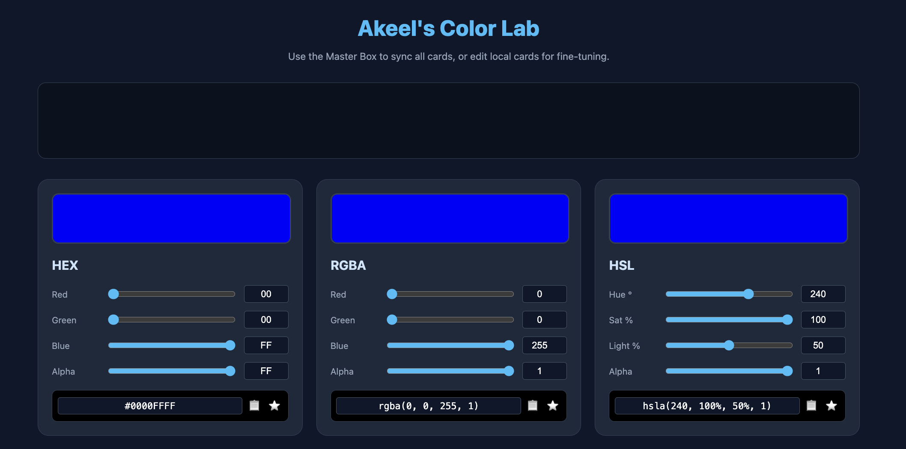

# qa-fullstack-series

> [!TIP]
> This is the repo for _completely FREE_ fullstack development with Qurashi Akeel.

## Resources:

0. This repo (access code for free): [github.com/qurashiakeel/qa-fullstack-series](https://github.com/qurashiakeel/qa-fullstack-series)
1. Subscribe Youtube Channel: [youtube.com/@qurashiakeel](https://www.youtube.com/@qurashiakeel)
2. Free CSS Color Lab for Youtube Subscribers: [click here](https://qurashiakeel.github.io/qa-fullstack-series/frontend/extras/color-lab/)
   

## Playlists:

Complete Frontend Playlist: [Check here](https://www.youtube.com/playlist?list=PLCM0RCSd8MWjbxzYu5H-Ey5RB9vgetiOH)

## Social Links:

1. Linkedin [linkedin.com/in/qurashiakeel/](https://www.linkedin.com/in/qurashiakeel/)
